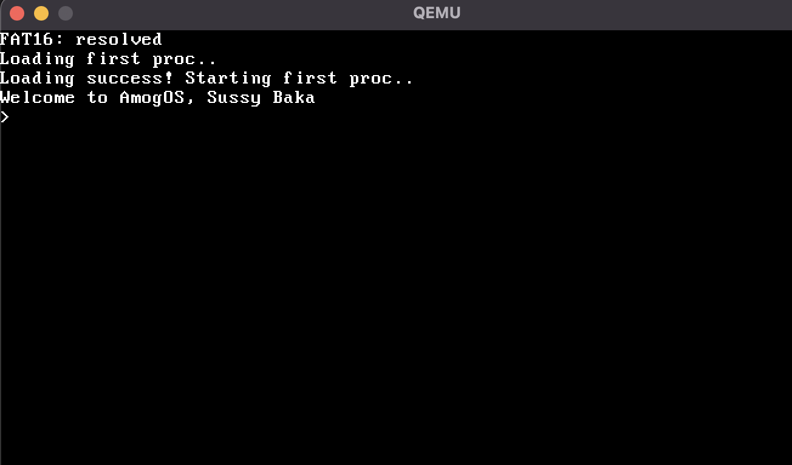
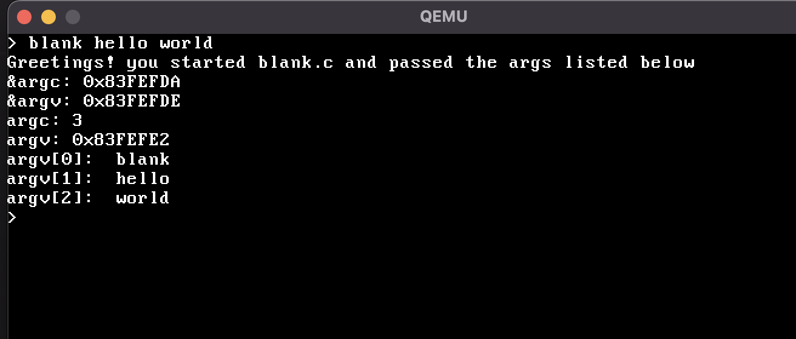
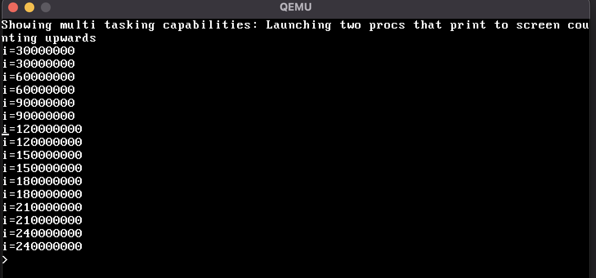

# AmogOS


A very simple 32 bit x86 kernel built from scratch.  


## Features / Implemented Items

- Bootloader
- Console
- Interrupts
- FAT16 Filesystem
- Simple Disk and PS/2 Keyboard Driver
- System Calls
- Paging and virtual address spaces
- Kernel and User Spaces
- User Programs
- Preemptive Multitasking
- ELF Loader
- Simple Shell

## Screenshots

Kernel bootup and shell



Running user program called `blank` that displays the user arguments.  



Enter `showmt` to see the multitasking in action:  
When we type `showmt` the shell launches two instances of a program that counts upwards by increment `i` in a for loop and prints `i={count}` every `30000000` iterations.  
We see that the output of the two programs is interleaved. This is because the kernel is preemptively multitasking between the two programs.




## System Calls

### Console

Reading and writing to the console is done through system calls.  

```c
void put_char(int c);
int get_key();
void cls(); // Clear the screen
```

The user library functions for helping with console IO are built on top of these:

```c
int printf(const char *fmt, ...);
void readline_terminal(char *buf, int max_len);
```

### Memory

```c
int mmap(void *va_start, void *va_end, int flags);
int munmap(void *va_start);
```

### Process Management

```c
int create_proccess(const char *file_path, int argc, int len, char *args);

int waitpid(int pid);
```

## User programs

User programs are located the in [programs](programs) directory. A `stdlib` for the user programs is also provided in [programs/stdlib](programs/stdlib) directory.  

Some Sample user programs:

- [shell.c](programs/shell/shell.c): A simple shell that can run other programs. This is loaded as the first user program by the kernel.  
- [black.c](programs/blank/blank.c): A simple program that displays the arguments.  

These user programs are compiled into ELF files and are added to the FAT16 filesystem image by `mkfs.py` (For now we need to add these manually to `mkfs.py` but this can be automated in the future easily).  

**User programs are expected to start above the virtual address `0x8400000`**.  

0x8400000 covers the kernel's address space that is mapped in the lower half of the process and some area for the stack of the user program.  
<!-- [ `elf_is_executable` function in `elfloader.c`] -->


## Build

Requirements

- i686-elf toolchain
- **MacOS only**: `pyfatfs` (Run make `macos_setup` to create a python venv in `.venv` and install `pyfatfs``)

```bash
make macos_setup # Only required on MacOS onetime to install pyfatfs

./build.sh
```

## Run on Qemu

Requirements:

- QEMU

```bash
make qemu
```

## Clean

```
make clean
```

## Format

Requirements:

- clang-format

```
make format
```

## Lint

Requirements:

- bear
- clang-tidy

```
make lint
```
